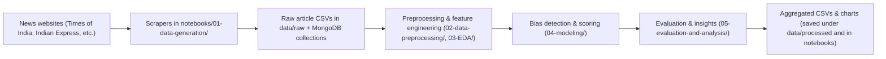
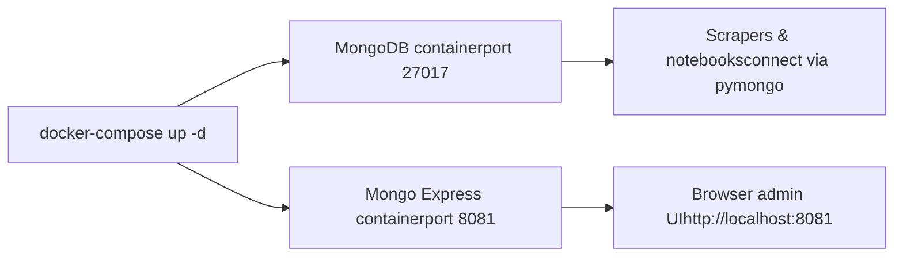
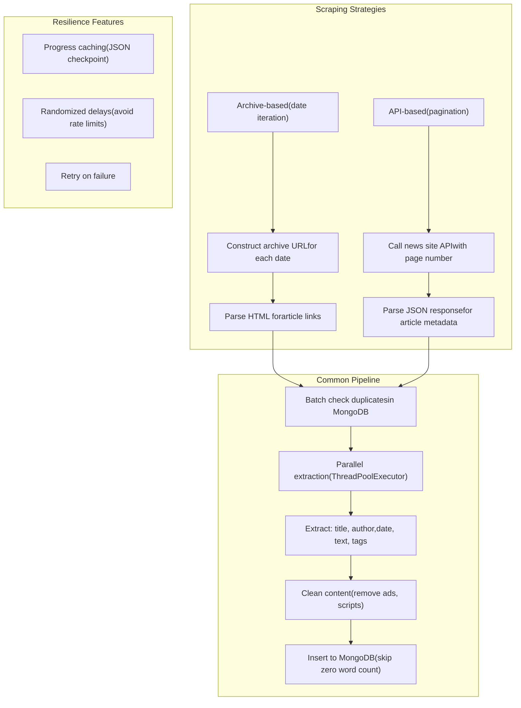
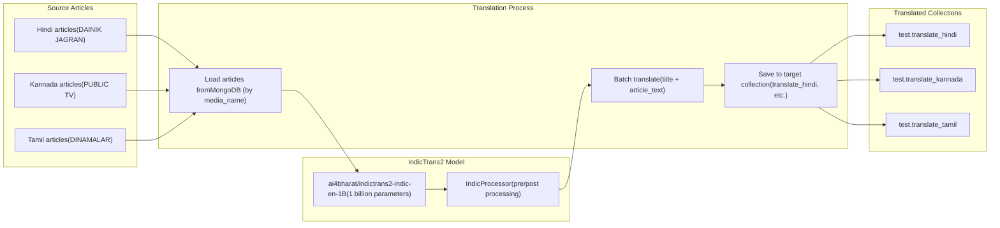
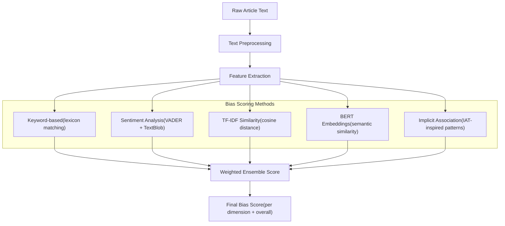
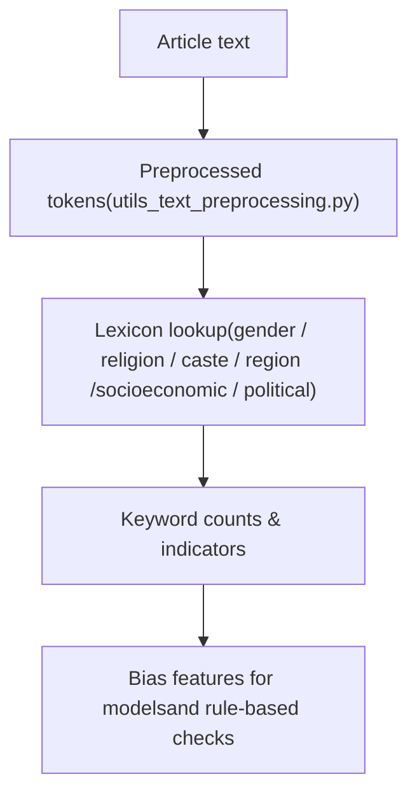
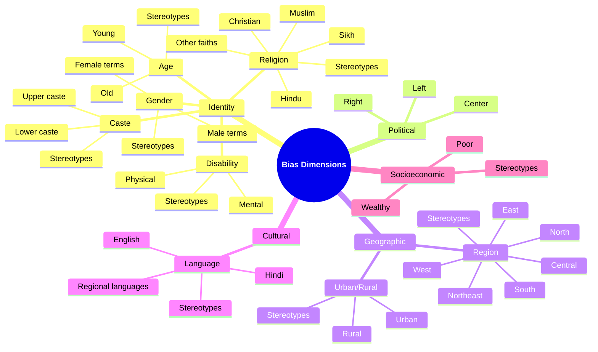

# Project Title: Bias Detection in Indian News Media 


## Team Members 
- Girish S N (girishsn@iisc.ac.in)
- Bharath Karanth A (bharathk@iisc.ac.in)
- Saravanakumar R (saravanakum1@iisc.ac.in)
- Anmol Gupta (anmolg@iisc.ac.in) 

---

## 1. Problem Statement 

News media outlets are often accused of biased reporting across various categories. 
With the rapid growth of digital news, readers are exposed to vast and diverse information at their fingertips, often with subtle biases. 
Biased reporting can influence public opinion and societal harmony. 
With increasing polarization and misinformation, unbiased reporting is critical. 
There is a need for a solution that can analyze news articles for bias – offering transparent, multi-dimensional, and interpretable results. 
This project seeks to provide researchers, fact-checkers, and the public with actionable insights into media bias in Indian journalism.  

---

## 2. Project Overview

The goal of this project is to build an **end-to-end bias detection and analysis pipeline** for news media: 

-   **Scrape** archives from multiple news organizations.
-   **Preprocess** and **clean** text with utilities tailored to the Indian news context.
-   **Translate** the articles in regional languages to English. 
-   Perform extensive **feature engineering**. 
-   **Detect** and **quantify** bias across categories – political, gender, religious, caste, regional, etc.
-   **Store results in MongoDB** for downstream analysis.
-   **Aggregate and visualize** long‑term trends and media‑wise patterns.

This repository is organized around **exploratory research in notebooks**, grouped by stage
(data generation, data preprocessing, EDA, modeling, and evaluation/analysis).

---

## 3. High‑Level Architecture



---

## 4. Repository Structure

Key top‑level directories/files:

-   **`notebooks/`**

    -   Jupyter notebooks / Python scripts organized by stage:
        -   `01-data-generation/` – scraping scripts for each news source.
        -   `02-data-preprocessing/` – cleaning and translation.
        -   `03-EDA/` – exploratory data analysis & feature exploration.
        -   `04-modeling/` – bias detection and topic modeling.
        -   `05-evaluation-and-analysis/` – intersectionality, explainability, trends, and topic–bias analysis.

-   **`data/`**

    -   Stores raw and processed CSV/Parquet outputs produced by notebooks.
    -   Includes calendar/event metadata such as
        `data/raw/india_calendar_events_1995_2025.csv`, with cleaned versions under `data/processed/`,
        used by EDA notebooks for holiday- and event-aware temporal features.

-   **`requirements.txt`**

    -   Python dependencies for the project.

-   **`docker-compose.yml`**

    -   Optional MongoDB + Mongo Express setup for local experimentation.

-   **`README.md`** (this file)

---

## 5. End‑to‑End Workflow

At a high level, the project is used in three phases:

1. **Data Collection** – Scraping the Indian news articles into CSV files.
2. **Data Cleaning** – Performing the pre-processing and cleaning of the raw data.
3. **Translation** – Performing the translation of the articles in regional languages to English.
4. **Feature Engineering** – Extracting useful features out of the cleaned and the translated data. 
5. **Bias Modeling** – Assigning bias scores across different categories, through various machine learning methods and ensemble techniques.
6. **Exploratory Visualization** – Generating and analyzing trends and results through charts.

---

### 5.1 Workflow Diagram

```mermaid
flowchart LR
    subgraph S[Data Collection & Cleaning]
        S1[Run Scraper Scripts]
        --> S2[Text Preprocessing and Cleaning]
    end

    subgraph T[Translation]
        T1[Use Translation Scripts to Convert non-English articles to English]
    end

    subgraph F[Feature Engineering]
        F1[Perform Extensive Feature Engineering]
    end
 
    subgraph M[Modeling & Bias Scoring]
        M1[Load the Robust Dataset]
        --> M2[Various Bias Scoring Methods]
        --> M3[Performing the Weighted Ensemble]
        --> M4[Save Bias Scored Articles to MongoDB]
    end
 
    subgraph V[Visualization]
        V1[Extract articles from MongoDB]
        --> V2[Create Charts]
    end
 
    S2 --> T1
    T1 --> F1
    F1 --> M1
    M4 --> V1
```



---

## 6. Components in Detail

### 6.1 Scraping (`notebooks/01-data-generation/`)

-   **Base Template**: `notebooks/01-data-generation/base_news_scraper.py`

    -   Handles:
        -   Date‑range iteration (year/month/day loops).
        -   Progress caching (`scraping_progress.json`).
        -   Data caching to CSV (`scraped_data_cache.csv`).
        -   Randomized delays to avoid hammering the servers.
    -   You implement `scrape_articles_for_date(year, month, day)` with
        website‑specific logic (archive URLs, HTML parsing, link filtering).

-   **Site‑Specific Scrapers** (examples under `notebooks/01-data-generation/`):
    -   `scrape_times_of_india.py`
    -   `scrape_indian_express.py`
    -   `scrape_publictv.py`
    -   `scrape_economic_times.py`

Each scraper typically:

-   Defines `BASE_URL`, `MEDIA_NAME`, `CACHE_DIR`.
-   Calls `scrape_articles(...)` from the base template.
-   Saves consolidated CSVs for downstream notebooks.

### 6.2 Text Preprocessing (`utils_text_preprocessing.py`)

Provides reusable utilities for **cleaning English news text in an Indian context**:

-   `setup_nltk()` – downloads required NLTK corpora (stopwords, punkt, wordnet, POS tagger).
-   `clean_text_basic()` – lower‑casing, URL/email removal, special‑character stripping.
-   `get_stop_words()` / `INDIAN_STOP_WORDS` – extended stopwords list with Indian‑specific terms.
-   `remove_stop_words()` – drops common and Indian‑context stopwords.
-   `lemmatize_text()` / `stem_text()` – WordNet lemmatization and Porter stemming.
-   `clean_text_complete()` – combined pipeline for basic cleaning + stopword removal + lemmatization
    or stemming.

These functions are imported and used across multiple notebooks for consistent preprocessing.

### 6.3 Bias Modeling & Analysis (`notebooks/`)

The numbered notebooks (`01_...`, `02_...`, ..., `20_...`) typically cover:

-   **Exploration & Cleaning** – initial dataset inspection, deduplication, basic stats.
-   **Calendar/Event Integration** – linking articles to key political or social events
    using the precomputed calendar dataset (`data/raw/india_calendar_events_1995_2025.csv`
    and its cleaned variants under `data/processed/`), then deriving holiday proximity and
    event-sentiment features.
-   **Feature Engineering** – keyword‑based, linguistic, discourse, representation,
    and semantic embedding features.
-   **Bias Detection Models** – assigning bias scores and types (e.g. `political_bias`,
    `gender_bias`, plus categorical `*_type` fields like `political_type`).
-   **Explainability** – attribution and explanation notebooks.
-   **Validation & Case Studies** – model evaluation, temporal trend analysis,
    media‑wise comparisons, and final dataset export.

Calendar features from the events dataset allow the project to study how coverage
and bias shift around religious holidays, national days, and high‑impact global
events (e.g. conflicts, disasters, and major scientific or political milestones).

Outputs from this stage are stored back in MongoDB and in CSVs under `data/`.

### 6.4 Visualization & Analysis (notebooks)

Visualization and higher‑level analysis are performed directly in notebooks, mainly:

-   `notebooks/03-EDA/` – feature distributions, temporal features, and early bias indicators.
-   `notebooks/05-evaluation-and-analysis/` – intersectionality analysis, explainability,
    temporal trends, and topic–bias correlations.

These notebooks read processed datasets from `data/processed/` and generate charts/plots
for bias trends over time, across outlets, and by dimension, including media comparisons.

---

## 7. Installation & Setup

### 7.1 Prerequisites

-   **Python**: 3.9+ recommended.
-   **MongoDB**: running instance with:
    -   A database/collection for bias‑scored articles (e.g. `realtime_news`).
    -   Optionally a `test.articles` collection for backfilling publish dates.
-   **Virtual environment** (recommended): `venv`, `conda`, or similar.

### 7.2 Docker Setup for MongoDB

The easiest way to run MongoDB locally is via Docker. A `docker-compose.yml` is provided:

```bash
# Start MongoDB + Mongo Express (web UI)
docker-compose up -d

# Check status
docker-compose ps

# Stop
docker-compose down

# Stop and remove data volumes
docker-compose down -v
```

**Services started:**

| Service           | Port    | Description                             |
| ----------------- | ------- | --------------------------------------- |
| **MongoDB**       | `27017` | Main database                           |
| **Mongo Express** | `8081`  | Web-based admin UI (login: admin/admin) |

Once running, connect via `mongodb://localhost:27017/` (no auth by default).



### 7.3 Python Dependencies (Core, Non‑Exhaustive)

From the current codebase, you will need at least:

-   **Data & Scientific**: `pandas`, `numpy`.
-   **NLP**: `nltk`.
-   **Web Scraping**: `requests`, `beautifulsoup4`.
-   **Database**: `pymongo`.
-   **Date handling**: `python-dateutil`.
-   **Plotting** (used in visualization scripts): typically `matplotlib`, `seaborn`.

Install them with `pip`, for example:

```bash
pip install pandas numpy nltk requests beautifulsoup4 pymongo python-dateutil matplotlib seaborn
```

If you later add a `requirements.txt`, you can switch to:

```bash
pip install -r requirements.txt
```

### 7.4 Configure MongoDB / Data Access

Most notebooks expect:

-   A working MongoDB instance (URI, database, collection names).
-   Read/write permissions for `data/raw/` and `data/processed/`.

Configure these via environment variables, a `.env` file, or by editing the connection cells
inside the notebooks.

---

## 8. Usage

### 8.1 Run a Scraper (Example)

From the project root:

```bash
python notebooks/01-data-generation/scrape_times_of_india.py
```

or any other site‑specific scraper under `notebooks/01-data-generation/`. Adjust years, cache
directory, and conditions inside the script as needed.

### 8.2 Work with Notebooks

1. Start Jupyter or VS Code / Jupyter Lab in the project root.
2. Open notebooks in `notebooks/` in numerical order as a guideline.
3. Import the text utilities where needed:

    ```python
    from utils_text_preprocessing import (
        setup_nltk,
        clean_text_complete,
        remove_stop_words,
        lemmatize_text,
        # ...
    )
    ```

4. Run preprocessing, feature engineering, model training, and evaluation cells.
5. Ensure final, bias‑scored articles are written to MongoDB and/or exported to
   `data/processed/` for downstream EDA and evaluation notebooks.

### 8.3 Generate Visualizations from Notebooks

Visualizations are produced interactively in notebooks:

-   Use `notebooks/03-EDA/` for feature‑level and temporal exploration.
-   Use `notebooks/05-evaluation-and-analysis/` for intersectionality, explainability,
    temporal trends, and topic‑bias correlation analyses.

Run the relevant notebooks cell by cell; figures will be displayed inline and/or saved to
paths configured inside the notebooks.

---

## 9. Extending the Project

Some ideas for extending this repository:

-   **New Media Sources**

    -   Copy or adapt `notebooks/01-data-generation/base_news_scraper.py` to a new file in the
        same folder.
    -   Customize `BASE_URL`, `MEDIA_NAME`, `CACHE_DIR`, and the site‑specific scraping logic.
    -   Run the new scraper as described in Section 7.1.

-   **Additional Bias Dimensions**

    -   Add new numeric bias score fields and corresponding `*_type` categorical labels.
    -   Update downstream EDA and evaluation notebooks to include new dimensions in
        aggregations and visualizations.

-   **Richer Visualizations**
    -   Extend notebooks in `notebooks/03-EDA/` and `notebooks/05-evaluation-and-analysis/`
        with additional plots (e.g., event‑aligned timelines, topic‑bias heatmaps,
        media similarity networks).

---

## 10. Scraping Strategy

The project scrapes news articles from multiple Indian media outlets using two main approaches:

### 10.1 Scraping Architecture



### 10.2 Scraping Methods by Source

| News Source        | Script                     | Language | Method                        | Archive/API URL Pattern                             |
| ------------------ | -------------------------- | -------- | ----------------------------- | --------------------------------------------------- |
| **Times of India** | `scrape_times_of_india.py` | English  | Archive (date)                | `/archivelist/year-{Y},month-{M},starttime-{N}.cms` |
| **Indian Express** | `scrape_indian_express.py` | English  | Archive (date)                | `/archive/{Y}/{M}/{D}/`                             |
| **Economic Times** | `scrape_economic_times.py` | English  | Archive (date)                | `/archivelist/year-{Y},month-{M},starttime-{N}.cms` |
| **News18**         | `scrape_news18.py`         | English  | Archive (date)                | `/archivelist/year-{Y},month-{M},starttime-{N}.cms` |
| **Dainik Jagran**  | `scrape_jagram.py`         | Hindi    | API (pagination)              | `api.jagran.com/.../news/national/{page}/{count}`   |
| **Public TV**      | `scrape_publictv.py`       | Kannada  | Category pages                | `/category/states/karnataka/page/{N}/`              |
| **Dinamalar**      | `scrape_dinamalar.py`      | Tamil    | Photos section (today-photos) | `/photos/today-photos/{article_id}`                 |

### 10.3 Scraping Statistics

| News Source    | Language | Articles Scraped | Time Taken |
| -------------- | -------- | ---------------- | ---------- |
| Times of India | English  |      2,023       |  80 hours* |
| Indian Express | English  |     1,92,050     |  95 hours  |
| Economic Times | English  |     1,38,785     |  80 hours  |
| News18         | English  |      49,685      |  30 hours  |
| Dainik Jagran  | Hindi    |      4,268       |  03 hours  |
| Public TV      | Kannada  |      5,059       |  04 hours  |
| Dinamalar      | Tamil    |      4,869       |  03 hours  |
| -------------- | -------- | ---------------- | ---------- |
| Total          |          |     3,96,739     |            |

*Note: Most of the articles scraped for The Times of India resulted in failure; hence the time taken is high, but the article count is very low.  

---

## 11. Translation Strategy

Non-English articles (Hindi, Kannada, Tamil) are translated to English before bias analysis.

### 11.1 Translation Pipeline



### 11.2 Translation Scripts

Scripts are located under `notebooks/02-data-preprocessing/02-data-translation/`:

| Script                            | Source Language | Language Code | Target Media  | Target Collection   |
| --------------------------------- | --------------- | ------------- | ------------- | ------------------- |
| `translate_hindi_to_english.py`   | Hindi           | `hin_Deva`    | DAINIK JAGRAN | `translate_hindi`   |
| `translate_kannada_to_english.py` | Kannada         | `kan_Knda`    | PUBLIC TV     | `translate_kannada` |
| `translate_tamil_to_english.py`   | Tamil           | `tam_Taml`    | DINAMALAR     | `translate_tamil`   |

### 11.3 Translation Model Details

| Attribute            | Value                               |
| -------------------- | ----------------------------------- |
| **Model**            | `ai4bharat/indictrans2-indic-en-1B` |
| **Parameters**       | 1 billion                           |
| **Source languages** | 22 Indic languages                  |
| **Target language**  | English (`eng_Latn`)                |
| **Toolkit**          | IndicTransToolkit (IndicProcessor)  |
| **Inference device** | CUDA > MPS > CPU (auto-detected)    |
| **Batch size**       | 2–5 articles                        |
| **Max length**       | 384 tokens                          |

### 11.4 Recommended Settings for Mac M1 Pro

For ~5000 Hindi articles on Mac M1 Pro (using MPS):

| Parameter               | Recommended Value | Notes                                       |
| ----------------------- | ----------------- | ------------------------------------------- |
| **Batch sizes to test** | 2, 4, 8, 16       | Benchmark each to find optimal              |
| **Expected sweet spot** | 2–8               | Typical for 1B model + long texts on M1 Pro |
| **num_beams**           | 1                 | Greedy decoding for speed                   |
| **max_length**          | 384               | Balance between quality and speed           |

**Tuning Tips:**

-   Start with `batch_size=2` and increment to find fastest throughput
-   Keep `num_beams=1` unless you specifically need higher translation quality
-   Monitor memory usage—M1 Pro has unified memory constraints
-   Use the benchmark results to pick the fastest configuration

## 12. Bias Scoring Methodology

The project uses multiple complementary methods to detect and score bias across 10 dimensions.

### 12.1 Methodology Overview



### 12.2 Bias Scoring Methods – Detailed Tables

Below, each table summarizes one method: what the notebook does, inputs/outputs, math intuition, and its role in this project.

#### 12.2.1 Keyword Counting

| Aspect       | Details                                                                                                                                |
| ------------ | -------------------------------------------------------------------------------------------------------------------------------------- |
| Notebook     | **Keyword-based bias features**                                                                                                        |
| Method       | **Keyword Counting**                                                                                                                   |
| Purpose      | Count how often bias-related lexicon terms appear for each bias dimension in an article.                                               |
| Inputs       | Cleaned article text; bias lexicons per dimension (gender, religion, caste, region, etc.).                                             |
| Outputs      | `{dim}_keyword_count`, `{dim}_intensity` (length-normalized count).                                                                    |
| Math         | For dimension `d`, let `L_d` be its lexicon and tokens `w_1..w_N`.<br>`count_d = sum_i 1[w_i in L_d]`.<br>`intensity_d ≈ count_d / N`. |
| Contribution | Transparent first-layer **bias presence signal** per article and dimension; core feature for later models and visualizations.          |
| Notes        | Sensitive to lexicon coverage; does not capture sarcasm, negation, or wider context.                                                   |

#### 12.2.2 Stereotype Density

| Aspect       | Details                                                                                                                             |
| ------------ | ----------------------------------------------------------------------------------------------------------------------------------- |
| Notebook     | **Keyword-based bias features**                                                                                                     |
| Method       | **Stereotype Density**                                                                                                              |
| Purpose      | Separate neutral mentions from explicitly stereotypical phrases within each dimension.                                              |
| Inputs       | Article tokens; stereotype sub-lexicons `S_d ⊂ L_d` for each dimension.                                                             |
| Outputs      | `{dim}_stereotype_density`.                                                                                                         |
| Math         | `stereo_count_d = sum_i 1[w_i in S_d]`.<br>`density_d = stereo_count_d / max(1, count_d)` where `count_d` is from keyword counting. |
| Contribution | Flags **how much of the coverage is stereotyping** rather than just mentioning a group.                                             |
| Notes        | Depends on how well stereotype lexicons are curated; extreme values possible with very few tokens.                                  |

#### 12.2.3 Co-occurrence of Dimensions

| Aspect       | Details                                                                                                      |
| ------------ | ------------------------------------------------------------------------------------------------------------ |
| Notebook     | **Keyword-based bias features**                                                                              |
| Method       | **Co-occurrence of Dimensions**                                                                              |
| Purpose      | Detect when multiple bias dimensions (e.g. caste + gender) appear in the same article.                       |
| Inputs       | `{dim}_keyword_count` for all dimensions.                                                                    |
| Outputs      | `{dim1}_{dim2}_cooccurrence` (0/1 flags, and similar features for other dimension pairs).                    |
| Math         | For dimensions `a` and `b`:<br>`co_ab = 1 if (count_a > 0 and count_b > 0) else 0`.                          |
| Contribution | Captures **intersectional and multi-dimensional bias contexts** where several identities are jointly framed. |
| Notes        | Binary: does not measure strength of association, only joint presence.                                       |

#### 12.2.4 VADER Sentiment

| Aspect       | Details                                                                                                                                   |
| ------------ | ----------------------------------------------------------------------------------------------------------------------------------------- |
| Notebook     | **Sentiment & emotion features**                                                                                                          |
| Method       | **VADER Sentiment**                                                                                                                       |
| Purpose      | Quantify overall sentiment of the article (or target spans) using a rule-based sentiment model.                                           |
| Inputs       | Raw or cleaned article text; VADER sentiment analyzer.                                                                                    |
| Outputs      | `sentiment_negative`, `sentiment_neutral`, `sentiment_positive`, `sentiment_compound` (often neg + compound used).                        |
| Math         | Lexicon-based valence model that sums token scores and adjusts for negation and intensifiers; produces a **compound** score in `[-1, 1]`. |
| Contribution | Indicates **emotional valence** around topics or groups, helping distinguish negative vs neutral coverage.                                |
| Notes        | Tuned for social media English; may mis-handle irony, code-mixed text, or highly domain-specific language.                                |

#### 12.2.5 TextBlob Subjectivity & Polarity

| Aspect       | Details                                                                                                                       |
| ------------ | ----------------------------------------------------------------------------------------------------------------------------- |
| Notebook     | **Sentiment & emotion features**                                                                                              |
| Method       | **TextBlob Subjectivity & Polarity**                                                                                          |
| Purpose      | Estimate how subjective vs objective the article is, and its coarse polarity.                                                 |
| Inputs       | Article text; TextBlob (or similar lexicon-based sentiment library).                                                          |
| Outputs      | `subjectivity`, `polarity`.                                                                                                   |
| Math         | Lexicon-based scoring: `polarity ∈ [-1,1]`, `subjectivity ∈ [0,1]`, computed as weighted averages over opinion-bearing words. |
| Contribution | Helps judge whether **biased language is expressed as opinionated commentary vs neutral reporting**.                          |
| Notes        | Coarse-grained; not tailored to Indian news; best used together with other signals.                                           |

#### 12.2.6 Emotion Detection

| Aspect       | Details                                                                                            |
| ------------ | -------------------------------------------------------------------------------------------------- |
| Notebook     | **Sentiment & emotion features**                                                                   |
| Method       | **Emotion Detection**                                                                              |
| Purpose      | Count words linked to basic emotions (e.g., anger, fear, joy, sadness, disgust, surprise).         |
| Inputs       | Article tokens; emotion lexicons `L_e` per emotion type `e`.                                       |
| Outputs      | `emotion_{type}_count` (e.g. `emotion_anger_count`, `emotion_fear_count`).                         |
| Math         | For each emotion `e`: `count_e = sum_i 1[w_i in L_e]` (often normalized by article length).        |
| Contribution | Reveals **emotional framing** of events and groups (e.g., fear-heavy rhetoric around a community). |
| Notes        | Lexicon coverage matters; does not capture context or strength beyond presence/absence.            |

#### 12.2.7 Discourse Analysis

| Aspect       | Details                                                                                                                                                   |
| ------------ | --------------------------------------------------------------------------------------------------------------------------------------------------------- |
| Notebook     | **Discourse & framing features**                                                                                                                          |
| Method       | **Discourse Analysis (voice & agency)**                                                                                                                   |
| Purpose      | Extract structural cues like passive/active voice and who appears as agent vs patient.                                                                    |
| Inputs       | Parsed sentences (POS tags, dependency parses); references to target groups/entities.                                                                     |
| Outputs      | `passive_voice_ratio`, `agency_score`, plus any quote/attribution features.                                                                               |
| Math         | `passive_voice_ratio ≈ (# passive clauses) / (# all clauses)`.<br>`agency_score` measures share of events where a group is grammatical subject vs object. |
| Contribution | Captures **subtle framing**: whether a group is mainly portrayed as **doer** or **victim**, or if responsibility is obscured with passive voice.          |
| Notes        | Depends on parser quality; can be noisy on long or complex news sentences.                                                                                |

#### 12.2.8 Implicit Association

| Aspect       | Details                                                                                                                                            |
| ------------ | -------------------------------------------------------------------------------------------------------------------------------------------------- |
| Notebook     | **Implicit / IAT-inspired patterns**                                                                                                               |
| Method       | **Implicit Association (regex patterns)**                                                                                                          |
| Purpose      | Detect stereotype-like patterns linking groups to traits (e.g., "X people are lazy").                                                              |
| Inputs       | Article text; regex/pattern rules encoding group–attribute templates for each bias dimension.                                                      |
| Outputs      | `implicit_{association}_score` per association type or dimension.                                                                                  |
| Math         | Count matches of stereotype patterns vs counter-patterns; a simple score can be `(matches - counter_matches) / max(1, matches + counter_matches)`. |
| Contribution | Provides a more **association-style bias signal**, closer to IAT ideas, beyond simple word counts.                                                 |
| Notes        | Rule-based; limited to patterns explicitly encoded; may miss nuanced or negated constructions.                                                     |

#### 12.2.10 Topic Classification

| Aspect       | Details                                                                                                                                                                                           |
| ------------ | ------------------------------------------------------------------------------------------------------------------------------------------------------------------------------------------------- |
| Notebook     | **Topic modelling & clustering**                                                                                                                                                                  |
| Method       | **Topic Classification (LDA + K-Means + keywords)**                                                                                                                                               |
| Purpose      | Assign each article to one or more topics to control for content when analyzing bias.                                                                                                             |
| Inputs       | Document-term representations (BoW / TF-IDF); number of topics; keyword heuristics.                                                                                                               |
| Outputs      | `lda_topic` (topic ID from LDA), `ensemble_topic` (stabilized topic label combining LDA, clustering, and keywords).                                                                               |
| Math         | LDA models documents as mixtures of topics (word distributions); K-Means clusters document vectors by minimizing within-cluster distance; an ensemble scheme reconciles these with keyword rules. |
| Contribution | Provides **topic context** (e.g., economy, crime, politics) so bias can be analyzed **within and across topics**.                                                                                 |
| Notes        | Topic labels are approximate and need interpretation; topics can overlap.                                                                                                                         |

#### 12.2.11 Ensemble Bias

| Aspect       | Details                                                                                                                                                                                                                |
| ------------ | ---------------------------------------------------------------------------------------------------------------------------------------------------------------------------------------------------------------------- |
| Notebook     | **Ensemble bias score**                                                                                                                                                                                                |
| Method       | **Ensemble Bias (keyword + TF-IDF + BERT)**                                                                                                                                                                            |
| Purpose      | Combine multiple bias signals into a final, robust bias score per dimension and overall.                                                                                                                               |
| Inputs       | Keyword-based scores, TF-IDF similarity scores, and BERT embedding similarity scores for each dimension.                                                                                                               |
| Outputs      | `ensemble_{dim}_bias`, `ensemble_overall_bias_score`.                                                                                                                                                                  |
| Math         | For a given dimension `d`, `E_d = α * K_d + β * T_d + γ * B_d` where `K_d`, `T_d`, `B_d` are keyword, TF-IDF, and BERT components; typical weights: with BERT `(0.30, 0.30, 0.40)`, without BERT `(0.40, 0.60, 0.00)`. |
| Contribution | Main **production-style bias indicator** used for plots and trend analysis; balances interpretability (keywords/TF-IDF) with semantic power (BERT).                                                                    |
| Notes        | Assumes component scores are calibrated; weight choice affects sensitivity to each signal.                                                                                                                             |

#### 12.2.12 Overall Bias Score Aggregation

| Aspect       | Details                                                                                                                                                                               |
| ------------ | ------------------------------------------------------------------------------------------------------------------------------------------------------------------------------------- |
| Section      | **Overall Bias Score Calculation**                                                                                                                                                    |
| Method       | **Overall Bias Score (dimension-weighted)**                                                                                                                                           |
| Purpose      | Aggregate per-dimension bias scores into a single scalar "overall bias" indicator per article.                                                                                        |
| Inputs       | Dimension-wise bias scores (e.g., `ensemble_{dim}_bias` or `bias_score_v2_{dim}`) for Political, Religious, Gender, Caste, Regional, Socioeconomic.                                   |
| Outputs      | `overall_bias_score`.                                                                                                                                                                 |
| Math         | Weighted sum: `overall_bias_score = Σ (dimension_score * dimension_weight)` with weights: Political 0.20, Religious 0.20, Gender 0.15, Caste 0.15, Regional 0.15, Socioeconomic 0.15. |
| Contribution | Provides a **single, comparable metric** for visualizations and for correlating with external indicators (e.g., RSF index).                                                           |
| Notes        | Weights encode design choices; users may reweight based on their research focus.                                                                                                      |

### 12.3 Overall Bias Score Calculation

The overall bias score is a weighted average of individual dimension scores. 

**Formula:**

```
overall_bias_score = Σ (dimension_score × dimension_weight)
```

For example, the dimension_weight could be the following:

| Dimension     | Weight |
| ------------- | ------ |
| Political     | 0.20   |
| Religious     | 0.20   |
| Gender        | 0.15   |
| Caste         | 0.15   |
| Regional      | 0.15   |
| Socioeconomic | 0.15   |


### 12.4 Bias Type Classification

Each dimension also produces a categorical bias type:

| Dimension     | Possible Types                                                                      |
| ------------- | ----------------------------------------------------------------------------------- |
| Gender        | `neutral`, `male_focus`, `female_focus`, `male_stereotyping`, `female_stereotyping` |
| Religious     | `neutral`, `{religion}_focus`, `{religion}_negative_stereotype`                     |
| Political     | `neutral`, `left_leaning`, `right_leaning`, `centrist`                              |
| Caste         | `neutral`, `upper_caste_focus`, `lower_caste_focus`, `balanced`                     |
| Regional      | `neutral`, `{region}_focus`, `{region}_negative_stereotype`                         |
| Socioeconomic | `neutral`, `wealthy_focus`, `poverty_focus`, `balanced`                             |

---

## 13. Notes

-   This README intentionally focuses on **high‑level architecture and usage**.
-   Many implementation details (model choices, feature definitions, evaluation protocol) live
    inside the notebooks. Refer to them for research‑grade documentation and experiments.

---

## 14. Lexicon Reference

The project uses a curated lexicon of bias‑related keywords across multiple dimensions.
This lexicon is used for keyword‑based features and interpretability. This forms the basis 
of the calculation of the bias scores. The original HTML version lives in `lexicon.html`; 
a Markdown summary is provided below.

### 14.1 Lexicon‑based Bias Detection (Diagram)



### 14.2 Gender keywords

| Category                 | Keywords                                                                                            |
| ------------------------ | --------------------------------------------------------------------------------------------------- |
| **Male terms**           | man, men, male, boy, he, him, his, himself, husband, father, son, brother, gentleman                |
| **Female terms**         | woman, women, female, girl, she, her, hers, herself, wife, mother, daughter, sister, lady           |
| **Stereotypical female** | nurturing, submissive, sensitive, dependent, emotional, weak, homemaker, caretaker, family-oriented |
| **Stereotypical male**   | tech-savvy, dominant, courageous, workaholic, strong, breadwinner, career-oriented, aggressive      |

### 14.3 Religious keywords

| Category                        | Keywords                                                                                            |
| ------------------------------- | --------------------------------------------------------------------------------------------------- |
| **Hindu**                       | hindu, hinduism, brahmin, kshatriya, vaishya, shudra, temple, puja, vedic, sanskrit, mandir, pandit |
| **Muslim**                      | muslim, islam, mullah, maulvi, mosque, namaz, allah, islamic, masjid, quran, imam                   |
| **Sikh**                        | sikh, sikhism, gurdwara, khalsa, singh, kaur, guru, gurudwara                                       |
| **Christian**                   | christian, christianity, church, jesus, bible, priest, pastor                                       |
| **Jain**                        | jain, jainism                                                                                       |
| **Buddhist**                    | buddhist, buddhism, buddha                                                                          |
| **Stereotypes – violent**       | terrorist, violent, aggressive, fundamentalist, extremist                                           |
| **Stereotypes – superstitious** | superstitious, backward, orthodox                                                                   |
| **Stereotypes – conservative**  | conservative, traditional, rigid                                                                    |

### 14.4 Caste keywords

| Category                    | Keywords                                                                                                                                           |
| --------------------------- | -------------------------------------------------------------------------------------------------------------------------------------------------- |
| **Upper caste**             | brahmin, kshatriya, thakur, rajput, arya, jaat, baniya, kayastha, upper caste, high caste, forward caste                                           |
| **Lower caste**             | dalit, shudra, sc, st, scheduled caste, scheduled tribe, obc, other backward class, bhangi, chamaar, valmiki, harijan, backward caste, lower caste |
| **Stereotypes – elitist**   | elitist, privileged, entitled, superior                                                                                                            |
| **Stereotypes – oppressed** | oppressed, discriminated, marginalized, subservient                                                                                                |

### 14.5 Regional keywords

| Category                   | Keywords                                                                                |
| -------------------------- | --------------------------------------------------------------------------------------- |
| **Northeast**              | northeast, assam, nagaland, manipur, tripura, meghalaya, mizoram, arunachal             |
| **North**                  | delhi, punjab, haryana, himachal, jammu, kashmir, uttarakhand, uttar pradesh, up, bihar |
| **South**                  | tamil nadu, kerala, karnataka, andhra pradesh, telangana, chennai, bangalore, hyderabad |
| **West**                   | maharashtra, gujarat, rajasthan, goa, mumbai                                            |
| **East**                   | west bengal, odisha, jharkhand, kolkata                                                 |
| **Central**                | madhya pradesh, chhattisgarh                                                            |
| **Stereotypes – racist**   | chinky, chinese-looking, mongoloid                                                      |
| **Stereotypes – backward** | backward, undeveloped, poor, illiterate                                                 |

### 14.6 Socioeconomic keywords

| Category                             | Keywords                                                                                        |
| ------------------------------------ | ----------------------------------------------------------------------------------------------- |
| **Wealthy**                          | rich, wealthy, affluent, elite, privileged, upper class, high society, millionaire, billionaire |
| **Poor**                             | poor, poverty, broke, underprivileged, lower class, slum, backward, disadvantaged, impoverished |
| **Stereotypes – elite disconnected** | out of touch, privileged, entitled                                                              |
| **Stereotypes – poor negative**      | criminal, lazy, uneducated, burden                                                              |

### 14.7 Political leaning keywords

| Category          | Keywords                                                                                                                                                                                                                                                                                     |
| ----------------- | -------------------------------------------------------------------------------------------------------------------------------------------------------------------------------------------------------------------------------------------------------------------------------------------- |
| **Left-leaning**  | equality, justice, progressive, welfare, reform, inclusive, diversity, socialism, redistribution, solidarity, equity, activism, feminism, environment, sustainability, labor rights, social justice, human rights, universal healthcare, climate action, workers rights, anti-discrimination |
| **Right-leaning** | nationalism, patriotism, security, sovereignty, tradition, culture, heritage, values, order, capitalism, market economy, privatization, self-reliance, individualism, law and order, family values, hindu nationalism, national pride, strong defense, immigration control, free market      |
| **Centrist**      | bipartisan, compromise, pragmatic, middle ground, consensus, balanced policy, moderation, collaboration, harmony, independent, neutral, unity, cooperation                                                                                                                                   |

### 14.8 Age keywords

| Category        | Keywords                                                               |
| --------------- | ---------------------------------------------------------------------- |
| **Young**       | youth, young, millennial, teenager, adolescent, student                |
| **Old**         | elderly, senior, old, aged, geriatric, pensioner                       |
| **Stereotypes** | entitled millennial, lazy youth, out of touch, senile, tech illiterate |

### 14.9 Disability keywords

| Category        | Keywords                                                                  |
| --------------- | ------------------------------------------------------------------------- |
| **Physical**    | disabled, handicapped, wheelchair, paralyzed, crippled, differently abled |
| **Mental**      | mental illness, depression, anxiety, psychiatric, mentally ill            |
| **Stereotypes** | suffer from, victim of, confined to wheelchair, burden, helpless          |

### 14.10 Urban/Rural keywords

| Category        | Keywords                                                               |
| --------------- | ---------------------------------------------------------------------- |
| **Urban**       | city, urban, metropolitan, cosmopolitan, town                          |
| **Rural**       | rural, village, countryside, agricultural, farming                     |
| **Stereotypes** | backward village, uneducated rural, sophisticated urban, rural poverty |

### 14.11 Language keywords

| Category               | Keywords                                                               |
| ---------------------- | ---------------------------------------------------------------------- |
| **Hindi**              | hindi, hindi speaking, hindi imposition, rashtrabhasha                 |
| **English**            | english speaking, english medium, westernized                          |
| **Regional languages** | tamil, telugu, bengali, marathi, gujarati, kannada, malayalam          |
| **Stereotypes**        | language chauvinism, linguistic minority, language barrier, vernacular |

---

## 15. Bias Dimensions Summary

The project analyzes **10 bias dimensions** using keyword-based detection:



---

## 16. Research References & System Design Links

The following works informed the design of bias dimensions, lexicons, datasets, and evaluation strategies in this project:

| Reference                                                                                                                                                                                            | Focus                                                                                                                            | Aspect of this system influenced                                                                                                                                                                                                    |
| ---------------------------------------------------------------------------------------------------------------------------------------------------------------------------------------------------- | -------------------------------------------------------------------------------------------------------------------------------- | ----------------------------------------------------------------------------------------------------------------------------------------------------------------------------------------------------------------------------------- |
| [Implicit Bias in Religion (Slideshare, 2019)](https://www.slideshare.net/AashayVerma1/implicit-bias-in-religion)                                                                                    | Overview of implicit religious bias and how political/religious narratives shape attitudes in India                              | Motivated explicit **religion** bias dimension and the use of **event-aware features** (holidays, major events) to study how coverage tone changes around religiously salient dates.                                                |
| [Religion insulates ingroup evaluations (social psychology literature)](https://www.researchgate.net/publication/258425272)                                                                          | Shows how religiosity and group identity can amplify **ingroup favoritism** without always producing explicit outgroup hostility | Informed the design of **religion bias types** that separately capture positive ingroup framing vs negative outgroup stereotyping, and motivated looking for subtle differences in tone between majority/minority religious groups. |
| [Measuring gender attitudes: Developing and testing Implicit Association Tests for adolescents in India (PLOS One, 2022)](https://journals.plos.org/plosone/article?id=10.1371/journal.pone.0264077) | Gender-attitude measurement using survey items, vignettes, and IATs in Indian adolescents                                        | Inspired the separation of **explicit keyword counts** vs **implicit association patterns** for gender, and informed the IAT-like regex patterns used in Notebook 10 (implicit bias detection).                                     |
| [IndiBias: A Benchmark Dataset to Measure Social Biases in Language Models for Indian Context (arXiv:2403.20147)](https://arxiv.org/abs/2403.20147)                                                  | Benchmark dataset of Indian social biases (gender, religion, caste, age, region, etc.) in Hindi and English                      | Helped shape the set of **bias dimensions** (gender, religion, caste, age, region) and reinforced the need for **intersectional bias analysis** across multiple attributes.                                                         |
| [RSF World Press Freedom Index 2025 (global report)](https://rsf.org/en/rsf-world-press-freedom-index-2025-economic-fragility-leading-threat-press-freedom)                                          | Global assessment of press freedom, with emphasis on economic fragility of media                                                 | Provides **macro justification** for automated bias monitoring and motivates tracking bias scores longitudinally so they can be compared with external press-freedom indicators.                                                    |
| [RSF – India Country Profile](https://rsf.org/en/country/india)                                                                                                                                      | Detailed overview of India’s media landscape, political context, legal and economic pressures                                    | Informed the choice of **Indian news outlets**, focus on long-term trends, and the requirement to analyze bias **per outlet and over time** rather than only at article level.                                                      |
| [The Habits of Online Newspaper Readers in India (Tewari, 2015)](https://www.researchgate.net/publication/285383241_The_Habits_of_Online_Newspaper_Readers_in_India)                                 | Empirical study of how Indian readers consume online news and prefer digital formats                                             | Guided assumptions about **which outlets/time-ranges** to prioritize and supported the decision to rely on **online archives** and web scrapers for large-scale bias analysis.                                                      |
| [Faux Hate: unravelling the web of fake narratives in spreading hatred and misinformation (Springer, 2024)](https://link.springer.com/article/10.1007/s10579-024-09732-0)                            | Analysis of fake and hateful narratives and how they spread online                                                               | Motivated inclusion of **event- and sentiment-aware features** (e.g., concurrent events, good/bad event counts) and informed the emphasis on detecting narratives that may amplify hate or misinformation in news coverage.         |

---

## 17. License & Usage Disclaimer

-   **Code License:** This repository is released under the **MIT License**. See the `LICENSE` file for full terms.
-   **Educational & Research Use:** This project analyzes news bias on topics that can be politically and socially sensitive.
    It is intended **solely for academic, exploratory, and educational purposes**.
-   **No Claims or Endorsements:** The bias scores, visualizations, and examples produced by this code **do not constitute
    factual claims, accusations, endorsements, or legal/journalistic conclusions** about any individual, organization,
    community, or media outlet.
-   **Methodological Limitations:** Results depend on the scraped data, preprocessing choices, lexicons, and models. They
    should be interpreted as **model-based signals** to support critical analysis, not as definitive ground truth.
